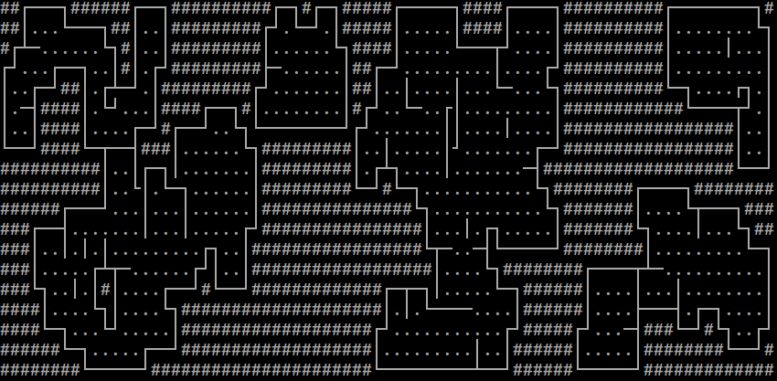
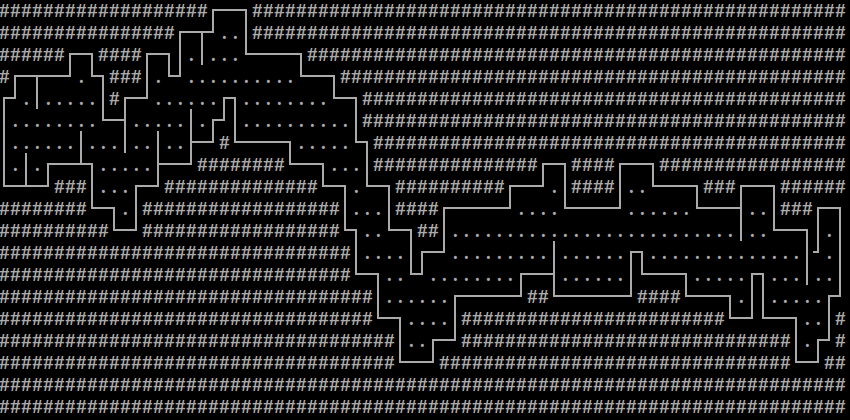
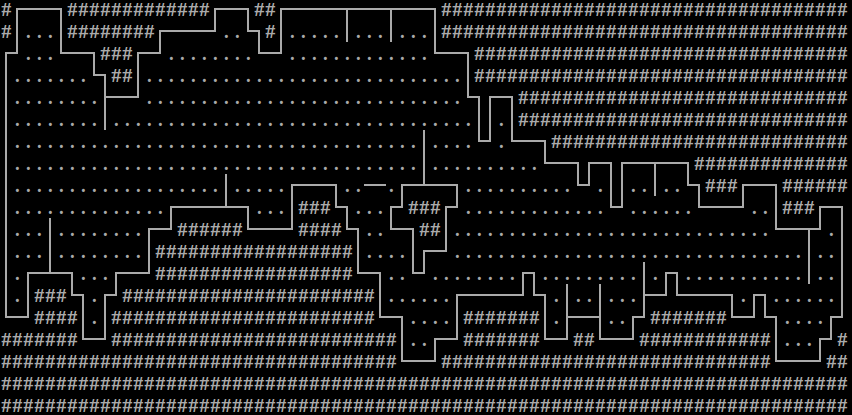
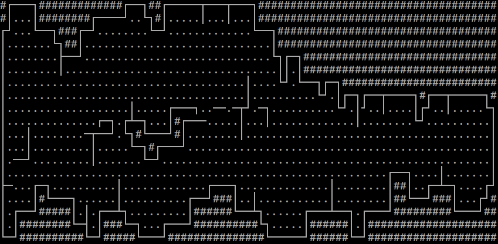
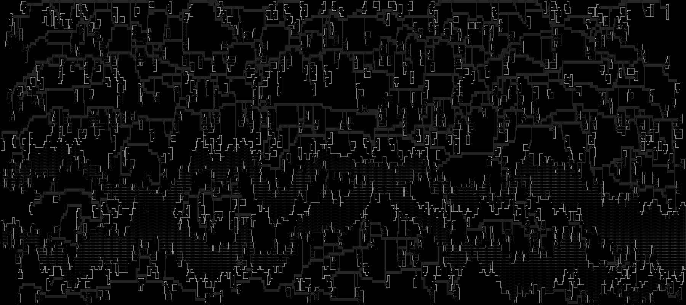
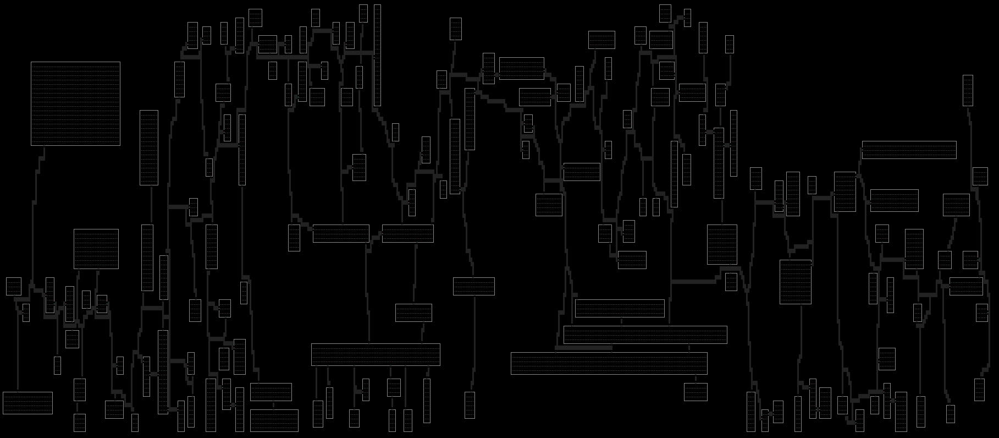
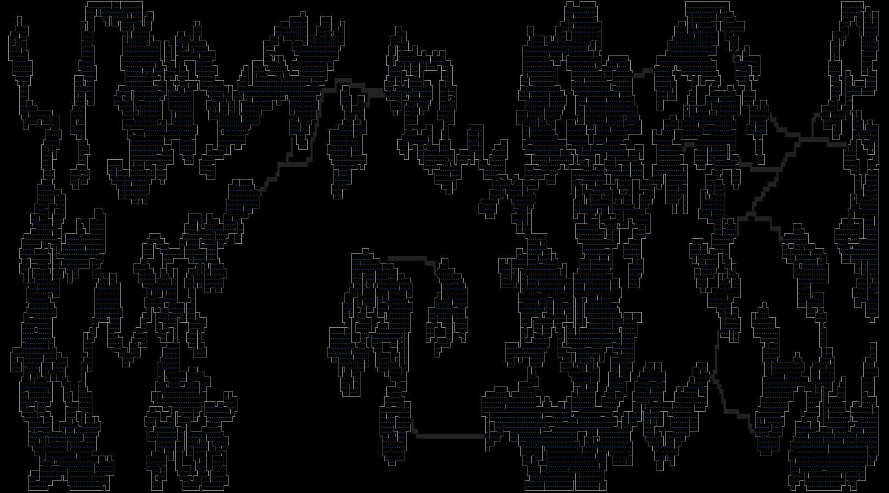
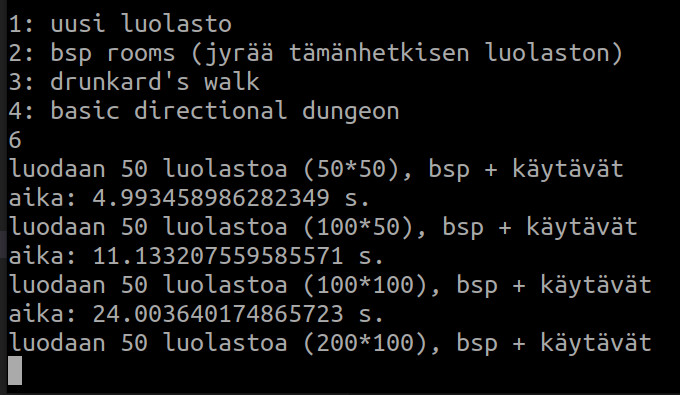

# Luolastogeneraattorin käyttöohje
Pääohjelma: src/index.py  
Saat seuraavat vaihtoehdot: (kuvitus viitteellinen)
1. uusi luolasto
  - Kysyy halutun leveyden ja korkeuden.
2. bsp rooms
  - Luo vähintään halutun määrän huoneita ja yhdistää niitä käytävillä. Visualisointimahdollisuus käytävien kaivamisen seuraamiseen. Jos ei onnistu luomaan huoneita sadalla yrityksellä (luolasto voi olla liian pieni), ilmoittaa asiasta.
    
  (BSP)
3. drunkard's walk
  - Aloittaa satunnaisesta kohdasta, liikkuu satunnaisesti pääsuuntiin kunnes annettu elinikä on loppu, jolloin aloittaa uudesta kohdasta. Syntyy uudestaan kunnes annettu osuus luolastosta on kaivettu.
    
  (Drunkard's walk tavoitteena 30, ikä 100)
4. basic directional dungeon
  - Kaivaa käytävän x-akselin suunnassa mutkitellen ja käytävän leveyttä vaihdellen annettujen parametrien mukaan. Voi olla kiinnostavampi ajettuna pariin kertaan.
    
  (Basic directional dungeon mutkaisuus 50, vaihtelu 10)
    
  (Algoritmi ajettu uudestaan samoilla parametreillä)
    
  (Vielä kolmannen kerran)
5. yhdistä komponentit (jos luolasto koostuu useammasta erillisestä yhtenäisestä komponentista, tämä tarkistetaan jokaisen operaation jälkeen ja komponentit merkataan tässä tapauksessa tunnuskirjaimin)
  - Kaivaa käytäviä erillisten komponenttien välille kunnes koko luolasto on saavutettavissa.
  - Visualisointi mahdollista, isomman kaivuun katselu voi kestää hyvin pitkään.

Aiemmin luolaston koko oli rajoitettu, rajoitus on nyt poistettu. Kattona toimii komponenttien etsimisessä käytettävän syvyyshaun rekursiosyvyys (tällä hetkellä se on asetettu olemaan 100'000 Pythonin oletusarvon 1'000 sijaan, en osannut ratkaista asiaa muuten) jota tarvitaan sitä enemmän mitä isompia komponentteja kartassa on.

(600*100 luolasto, ajettu 2 kertaa 'basic directional dungeon', kerran 'drunkard's walk', ja yhdistetty komponentit käytävillä)

(600*100 luolasto, ajettu bsp luomaan vähintään 150 huonetta)

(Drunkard's walk + komponenttien yhdistys 400*100 luolastossa, tavoite 30, ikä 200)

# Testaus

Testejä  on vasta vähän mutta ne voi ajaa poetry shellin kautta:  

    poetry install
    poetry shell
    pytest src

Ohjelmassa on nyt hyvin alkeellinen suorituskykytesti. Sen voi käynnistää valitsemalla
päävalikossa vaihtoehdon 6. Tästä nähdään että luolaston koon kaksinkertaistuessa tarvittava aika hieman yli kaksinkertaistuu. En ole vielä tutkinut tarkemmin aikavaatimuksia mutta tiedän että suurin osa ajasta menee käytävien luomiseen.

