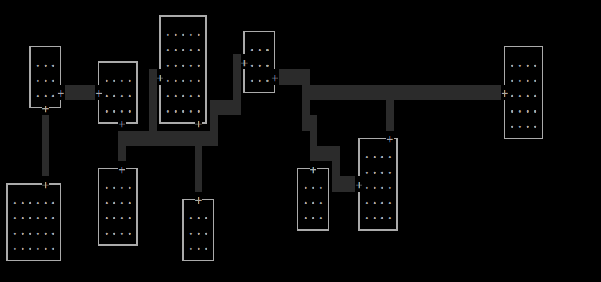

# Luolastogeneraattorin käyttöohje
Pääohjelma: src/index.py  
Saat seuraavat vaihtoehdot:
1. uusi luolasto
  - Kysyy halutun leveyden ja korkeuden. Leveys on rajattu terminaalin leveyden takia
2. bsp rooms
  - Luo 7-12 huonetta ja yhdistää niitä käytävillä. Visualisointimahdollisuus käytävien kaivamisen seuraamiseen. Jos ei onnistu luomaan huoneita sadalla yrityksellä (luolasto voi olla liian pieni), ilmoittaa asiasta.
    
  (BSP)
3. drunkard's walk
  - Aloittaa satunnaisesta kohdasta, liikkuu satunnaisesti pääsuuntiin kunnes annettu elinikä on loppu, jolloin aloittaa uudesta kohdasta. Syntyy uudestaan kunnes annettu osuus luolastosta on kaivettu.
    
  (Drunkard's walk tavoitteena 30, ikä 100)
4. basic directional dungeon
  - Kaivaa käytävän x-akselin suunnassa mutkitellen ja käytävän leveyttä vaihdellen annettujen parametrien mukaan. Voi olla kiinnostavampi ajettuna pariin kertaan.
    
  (Basic directional dungeon mutkaisuus 50, vaihtelu 10)
    
  (Algoritmi ajettu uudestaan samoilla parametreillä)
    
  (Vielä kolmannen kerran)
5. yhdistä komponentit (jos luolasto koostuu useammasta erillisestä yhtenäisestä komponentista, tämä tarkistetaan jokaisen operaation jälkeen ja komponentit merkataan tässä tapauksessa tunnuskirjaimin)
  - Kaivaa käytäviä erillisten komponenttien välille kunnes koko luolasto on saavutettavissa.
