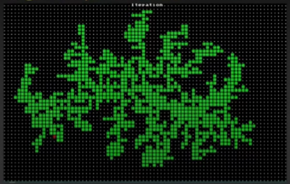

# Tiralabra: luolastogeneraattori, määrittelydokumentti

Tarkoituksena on luoda Python-ohjelma joka generoi luolastoja [roguelike](https://fi.wikipedia.org/wiki/Roguelike)-peligenren hengessä. Käytettäviä algoritmeja en vielä tarkkaan tiedä, haluan toteuttaa ainakin kaksi erilaista. Toinen voisi olla [Wave Function Collapse](https://www.youtube.com/watch?v=fnFj3dOKcIQ) ja toinen ehkä [Diffusion Limited Aggregation](https://www.youtube.com/watch?v=TlLIOgWYVpI&t=496s) tai ilmeisesti [Nethackissa](https://fi.wikipedia.org/wiki/NetHack) käytetty [Binary Space Partitioning Rooms](http://www.roguebasin.com/index.php/Basic_BSP_Dungeon_generation). Uskoakseni luolasto on järkevintä säilyttää kaksiulotteisessa taulukossa. Aika- ja tilavaatimuksista en osaa vielä sanoa; jos tarkoitus on luoda tyypillisen kokoisia luolastoja, en usko että niistä tulee ongelmaa. Kiinnostavaa voisi toki olla luoda paljon isompiakin. Ohjelmaan tulee käyttöliittymä jossa voi valita käytettävän algoritmin ja jotain siihen liittyviä muuttujia, ja käynnistysnappi tai -toiminto joka luo luolaston annettujen parametrien mukaan. Käyttöliittymä tulee mahdollisesti olemaan tekstipohjainen koska roguelikeissä on perinteisesti käytetty ASCII-grafiikkaa. Lähteitä tuntuu löytyvän kiitettävästi, ainakin [Roguebasin-wiki](http://roguebasin.com/index.php/Articles#Map) ja Herbert Wolversonin [luento](https://www.youtube.com/watch?v=TlLIOgWYVpI) Roguelike Celebrationin Youtube-kanavalla vaikuttavat lupaavilta.

Valitsin aiheen koska tämä peligenre kiinnostaa jo 1990-luvulta asti. Muut kielet joita voin kuvitella katselmoivani ovat C++ ja Java. Opinto-ohjelmani on tietojenkäsittelytieteen kandi ja teen tämän projektin kokonaan suomeksi.

  

  
Wave Function Collapse, kaksi esimerkkiä (lähde: [Brian Bucklew - Dungeon Generation via Wave Function Collapse](https://www.youtube.com/watch?v=fnFj3dOKcIQ))

  
Yllä: Diffusion Limited Aggregation, alla: BSP Rooms (lähde: [Herbert Wolverson - Procedural Map Generation Techniques](https://www.youtube.com/watch?v=TlLIOgWYVpI))  
  
