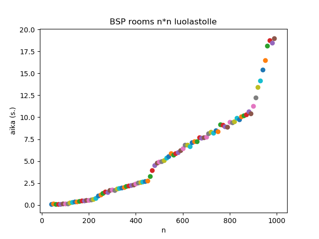
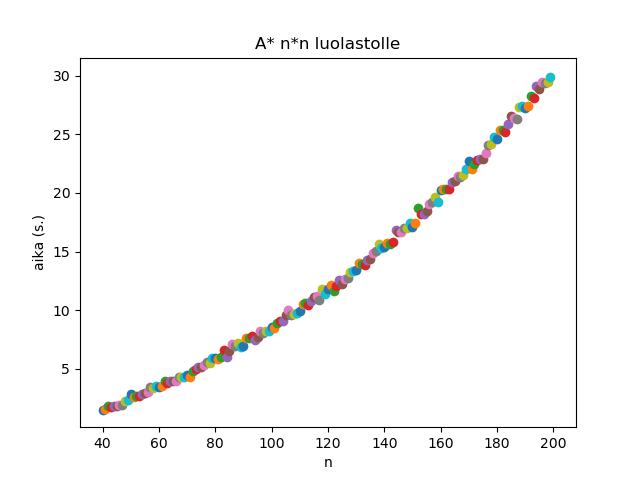
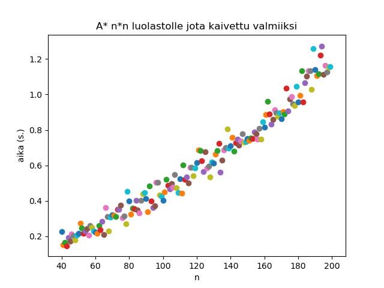

# Testausdokumentti

## BSP Rooms
BSP Rooms-algoritmin suorituskykyä testasin luomalla huoneita n\*n kokoisiin luolastoihin n arvoilla 40, 50, 60, ... 980, 990. Algoritmi sisältää jonkin verran satunnaisuutta joten päädyin ajamaan sen jokaiselle koolle 50 kertaa peräkkäin luotettavamman aikamittauksen saamiseksi. Yhteensä testiin meni läppärilläni n. 12 minuuttia.  
Etukäteen arvelin että aikavaatimus olisi O(log m) (missä m on ruutujen määrä luolastossa eli tässä tapauksessa n²) koska algoritmi toimii puolittamalla aluetta rekursiivisesti. Testi näyttää kuvaajan perusteella kuitenkin olevan O(n²) eli lineaarisessa suhteessa luolaston sisältämien ruutujen määrään. n\*m -suorakulmion muotoisessa luolastossa tämä tarkoittaisi O(n\*m)  

## A* (käytävien reitinhaku)
A\*-algoritmia testasin samaan tapaan. Tällä kertaa n oli 40, 41, 42, ... 198, 199. Testissä neliön muotoisen luolaston vastakkaisiin nurkkiin luotiin huoneet ja algoritmi etsi reitin, taas 50 kertaa jokaisessa koossa. Kuvaaja näyttää olevan O(n log n) mutta toistaiseksi en osaa sanoa miksi. Tämän testin ajaminen vei noin puoli tuntia.  
  

Itse ohjelmassa A\* ajetaan kerran jokaiselle komponentille tai huoneelle joka halutaan yhdistää muihin. Ajankäyttöä kuitenkin helpottaa se että algoritmi löytää jo valmiiksi avoimia reittejä pitkin nopeammin kohteeseen. Seuraavassa kuvassa testi oli muuten sama kuin yllä mutta 50% luolastosta oli kaivettu auki drunkard's walk-algoritmilla. Tämä synnytti jonkin verran hajontaa mutta aikaa reittien löytämiseen kului huomattavasti vähemmän.  
  
